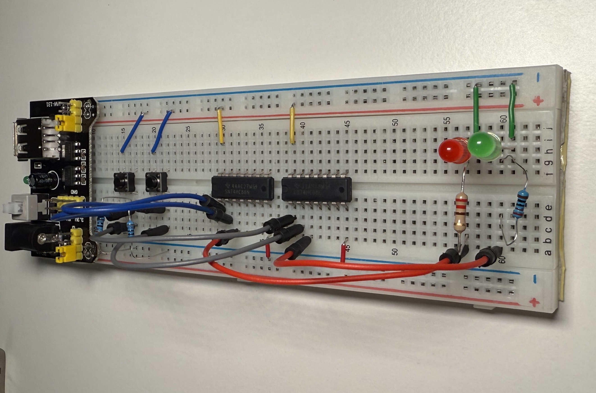
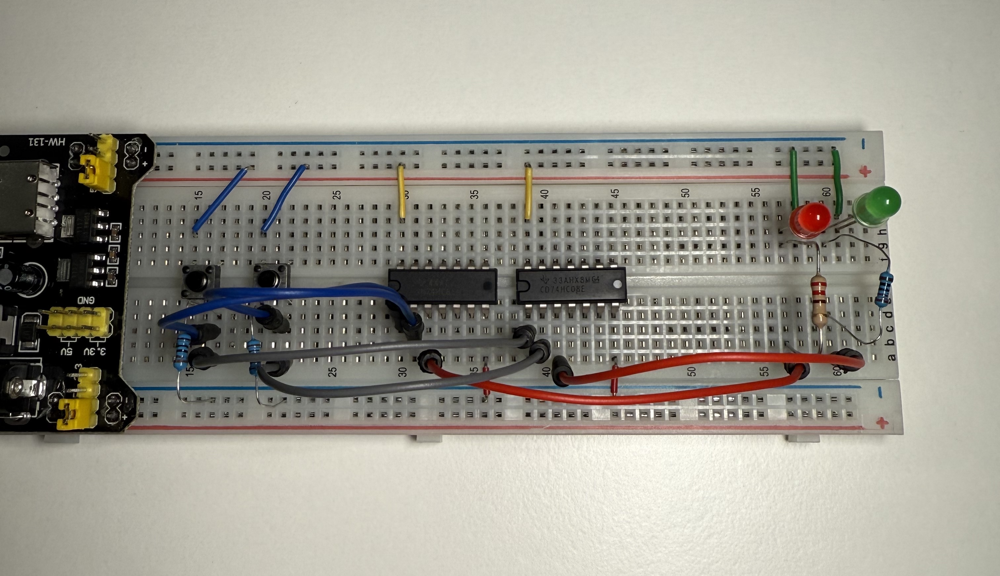
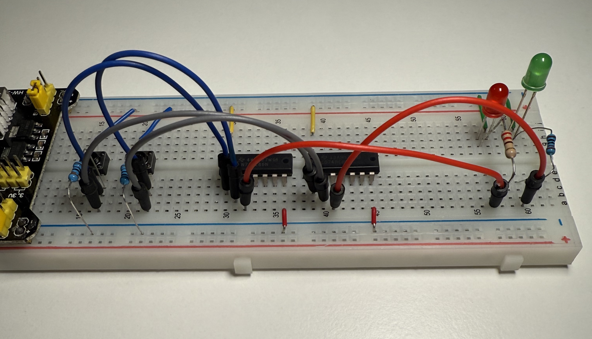
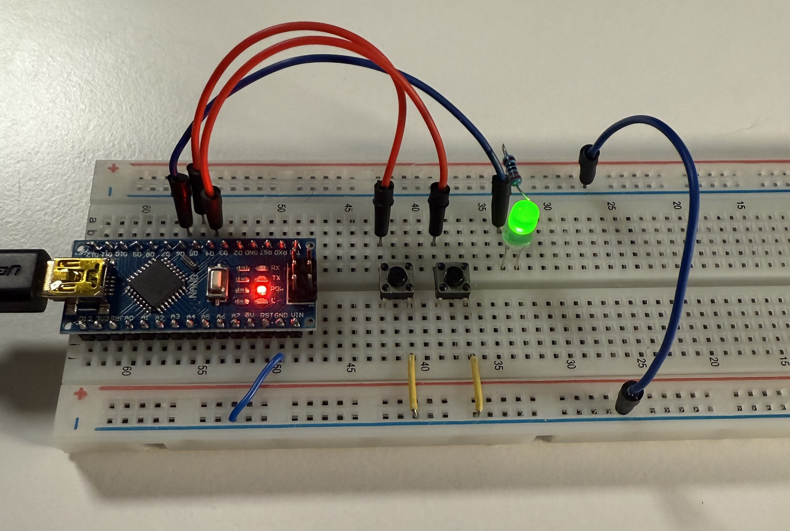
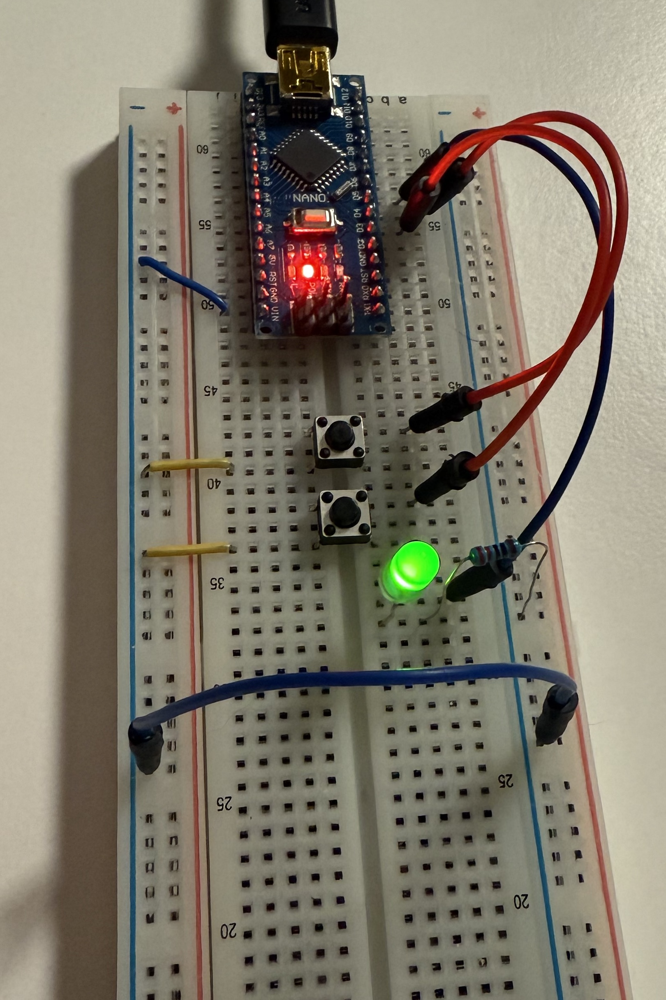

The projects below are a small lab log of breadboard experiments with logic ICs (like the 74xx series) and an Arduino Nano (power distribution, NPN transistors, LED drivers and the like).

## Index

1. OR, AND gates
2. Using Arduino Nano to power the Breadboard (5V)
3. Using Arduino Nano to blink a green and red LEDs
4. Implementing 1 bit of memory - SR latch
5. Implementing 1 bit of memory - with Arduino code
6. LED chaser with a 555 timer and a CD4017 IC 


---

## Project #1
### OR, AND gates 

The breadboard contains an OR gate and AND gate.

Inputs are controlled with pushbuttons.

The outputs are connected to LEDs to easily observe their states. Gates act independently.

- Power: 5V
- 7408 QUADRUPLE 2-INPUT POSITIVE-AND 
- 7486 Quad EXCLUSIVE-OR Gate
- Red LED: 330Ω
- Red LED: 220Ω (probably)

---









---


## Project #2
### Using Arduino Nano to power the Breadboard (5V)

- Nano pin 5V to Positive
- Nano pin GND to Negative/Ground on BB


---


## Project #3
### Using Arduino Nano to blink a green and red LEDs

[!] Make sure GNDs are connected

(Pushbuttons were not supposed to be there, so please ignore them)

#### Code:

- Blinks the 2 LEDs with different intervals.
- LED pins 1 and 2 are connected to PN2222 Base.

```
const int led1Pin = 4;
const int led2Pin = 5;

const unsigned long led1IntervalMs = 250;
const unsigned long led2IntervalMs = 350;

unsigned long lastLed1 = 0;
unsigned long lastLed2 = 0;

bool led1State = false;
bool led2State = false;

void setup() {
  pinMode(led1Pin, OUTPUT);
  pinMode(led2Pin, OUTPUT);
  digitalWrite(led1Pin, LOW);
  digitalWrite(led2Pin, LOW);
}

void loop() {
  unsigned long now = millis();

  if (now - lastLed1 >= led1IntervalMs) {
    lastLed1 = now;
    led1State = !led1State;
    digitalWrite(led1Pin, led1State ? HIGH : LOW);
  }

  if (now - lastLed2 >= led2IntervalMs) {
    lastLed2 = now;
    led2State = !led2State;
    digitalWrite(led2Pin, led2State ? HIGH : LOW);
  }
}
```


#### On the board:
- Transistor 1: PN2222 / T1
- Resistor 1: 2.0 kΩ
- Transistor 2: PN2222 / T2
- Resistor 2: 2.0 kΩ
- Green LED
- Green LED resistor 220Ω
- Red LED
- Red LED resistor 220Ω


#### Nano pins:
- D4 + 2.0 kΩ to Base of T1
- D5+ 2.0 kΩ to Base of T2
- GND to GND of the power source

PN2222 Collector -> LED cathode  / 2x

#### Conditions and assumptions:
Arduino Nano pin is 5 V. 
A PN2222 base-emitter drop is about 0.7V ([PN2222 specs](docs/PN2222-D.pdf))


Given:
```
V_OUT ≈ 5.0 V
V_BE ≈ 0.7 V
R_B = 2 kΩ = 2000 Ω
```

Base current:
```
I_B ≈ (V_OUT - V_BE) / R_B
I_B ≈ (5.0 - 0.7) / 2000
I_B ≈ 4.3 / 2000
I_B ≈ 0.00215 A
I_B ≈ 2.15 mA
```

Collector current estimate using forced beta of 10:
```
beta_forced ≈ 10
I_C ≈ beta_forced * I_B
I_C ≈ 10 * 2.17 mA
I_C ≈ 21.7 mA
```


[Formulas](formulas.md)

---


---


## Project #4
### Implementing 1 bit of memory - SR latch

The "memory" is built on an **SR latch** using 2 analog **NOR gates**.

The two chips below implement NOR gates because I didn't have a single NOR chip. There are 2 NOR gates on the board, as needed to implement a single SR latch device with 2 imputs (S, R) and 1 output Q.

- `SN74HC32N (7432)`  [SNx4HC32 Quadruple 2-Input OR Gates](docs/sn74hc32.pdf)
- `SN74HC04N (7404)`  [SNx4HC04 Hex Inverters](docs/sn74hc04.pdf)

SR latch is a type of memory device that remembers 1 bit. The SR latch has
two inputs: S (set) and R (reset), and an output Q, the single bit that is "remembered".

- The red LED represents Q
- The blue LED represents "not Q" to visualize circuit state
- When using an SR latch we typically only look at Q to determine whether the bit is true or false.


---


On the first picture below S is pressed, so the Q is HIGH, meaning that the bit is 1. The state is remembered.


On the first picture below R was pressed, so the Q is LOW, and "not Q" is HIGH (the blue LED).


---


## Project #5
### Implementing 1 bit of memory - Arduino code

This time the **SR latch** "memory" is built in code, using a C function that implements NOR gates instead of analog (hardware) logic gates.


```
const int button1vendD4 = 4;
const int button2coinD5 = 5;
const int ledPin = 6;

struct SRLatch {
  uint8_t Q;
  uint8_t Qbar;
};

uint8_t NOR_gate(uint8_t A, uint8_t B) {
  return !(A || B); // logical NOR
}

void SR_update(SRLatch &l, uint8_t S, uint8_t R) {
  uint8_t q = l.Q;
  uint8_t qb = l.Qbar;

  uint8_t nextQ = NOR_gate(R, qb); // Q depends on R and previous Qbar
  uint8_t nextQb = NOR_gate(S, q); // Qbar depends on S and previous Q

  l.Q = nextQ;
  l.Qbar = nextQb;
}

SRLatch latch = { 0, 1 }; // start reset-ish: Q=0, Qbar=1

void setup() {
  pinMode(button1vendD4, INPUT_PULLUP);
  pinMode(button2coinD5, INPUT_PULLUP);

  pinMode(ledPin, OUTPUT);
  digitalWrite(ledPin, LOW);
}

void loop() {
  uint8_t r = (digitalRead(button1vendD4) == LOW) ? 1 : 0;
  uint8_t s = (digitalRead(button2coinD5) == LOW) ? 1 : 0;

  SR_update(latch, s, r);
  digitalWrite(ledPin, latch.Q ? HIGH : LOW);
}
```








---


## Project #6
### LED chaser with a 555 timer and a CD4017 IC


#### 1) Clock generator (NE555 astable)

**Parts used**

* NE555 as an astable oscillator
* Timing resistors: 10 kΩ + 2 MΩ
* Timing capacitor: 0.1 µF
* Control-pin decoupling: 0.1 µF on pin 5 (CTRL) to GND
* Recommended: 100 nF decoupling between VCC and GND close to the 555

**Wiring**

* The 555 sits straddling the breadboard's center gap.
* Pin 3 (OUT) is the "clock" line running from the 555 area to the CD4017.


---

#### 2) Sequencer (CD4017 decade counter)

**Parts used**

* CD4017
* The **clock input** of the 4017 is fed from **555 pin 3**.


---

#### 3) LED outputs

Direct CD4017 to LED: LED series resistors: 330 Ω, one per LED


---

### Power and build notes

* Supply: 5 V
* Optionally add decoupling caps (100 nF) close to each IC between VCC and GND (helps stability and reduces weird flicker). However, I didn't do it.
* Assembly/testing order from my notes:

  1. Build and verify the 555 clock first (I used a debug LED) and a multumeter to measure clock signal voltage.
  2. Add the CD4017 and confirm the LEDs "chase".
  3. Then add the transistor-driven outputs.

