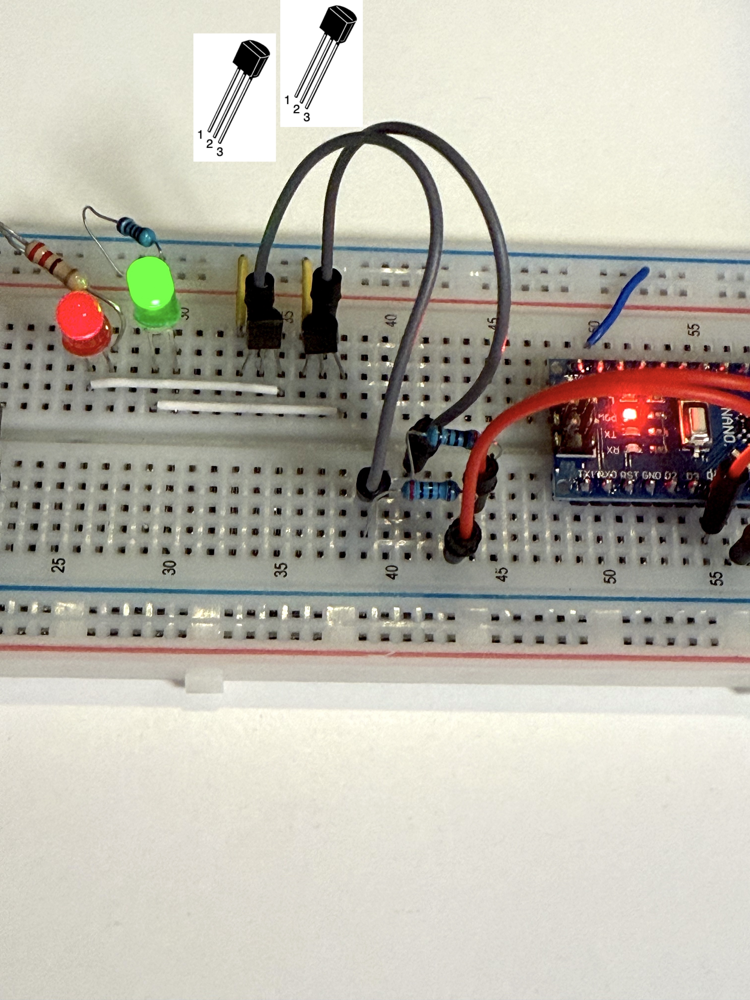
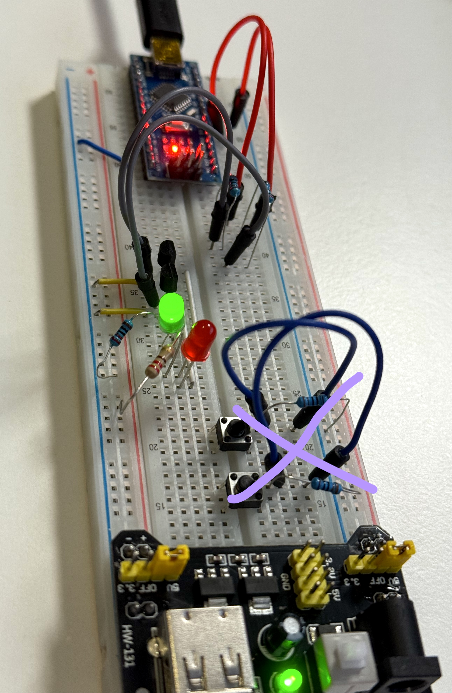
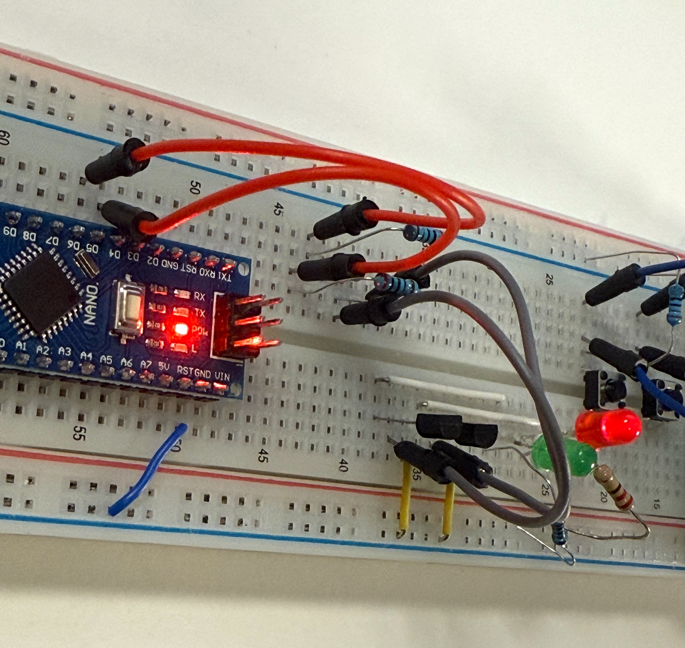

# Project 3 — Using Arduino Nano to blink a green and red LEDs

[!] Make sure GNDs are connected

(Pushbuttons were not supposed to be there, so please ignore them)

#### Code:

- Blinks the 2 LEDs with different intervals.
- LED pins 1 and 2 are connected to PN2222 Base.

```
const int led1Pin = 4;
const int led2Pin = 5;

const unsigned long led1IntervalMs = 250;
const unsigned long led2IntervalMs = 350;

unsigned long lastLed1 = 0;
unsigned long lastLed2 = 0;

bool led1State = false;
bool led2State = false;

void setup() {
  pinMode(led1Pin, OUTPUT);
  pinMode(led2Pin, OUTPUT);
  digitalWrite(led1Pin, LOW);
  digitalWrite(led2Pin, LOW);
}

void loop() {
  unsigned long now = millis();

  if (now - lastLed1 >= led1IntervalMs) {
    lastLed1 = now;
    led1State = !led1State;
    digitalWrite(led1Pin, led1State ? HIGH : LOW);
  }

  if (now - lastLed2 >= led2IntervalMs) {
    lastLed2 = now;
    led2State = !led2State;
    digitalWrite(led2Pin, led2State ? HIGH : LOW);
  }
}
```


#### On the board:
- Transistor 1: PN2222 / T1
- Resistor 1: 2.0 kΩ
- Transistor 2: PN2222 / T2
- Resistor 2: 2.0 kΩ
- Green LED
- Green LED resistor 220Ω
- Red LED
- Red LED resistor 220Ω


#### Nano pins:
- D4 + 2.0 kΩ to Base of T1
- D5+ 2.0 kΩ to Base of T2
- GND to GND of the power source

PN2222 Collector -> LED cathode  / 2x

#### Conditions and assumptions:
Arduino Nano pin is 5 V. 
A PN2222 base-emitter drop is about 0.7V ([PN2222 specs](../docs/PN2222-D.pdf))

Given:
```
V_OUT ≈ 5.0 V
V_BE ≈ 0.7 V
R_B = 2 kΩ = 2000 Ω
```

Base current:
```
I_B ≈ (V_OUT - V_BE) / R_B
I_B ≈ (5.0 - 0.7) / 2000
I_B ≈ 4.3 / 2000
I_B ≈ 0.00215 A
I_B ≈ 2.15 mA
```

Collector current estimate using forced beta of 10:
```
beta_forced ≈ 10
I_C ≈ beta_forced * I_B
I_C ≈ 10 * 2.17 mA
I_C ≈ 21.7 mA
```


[Formulas.md](../formulas.md)

---








---
