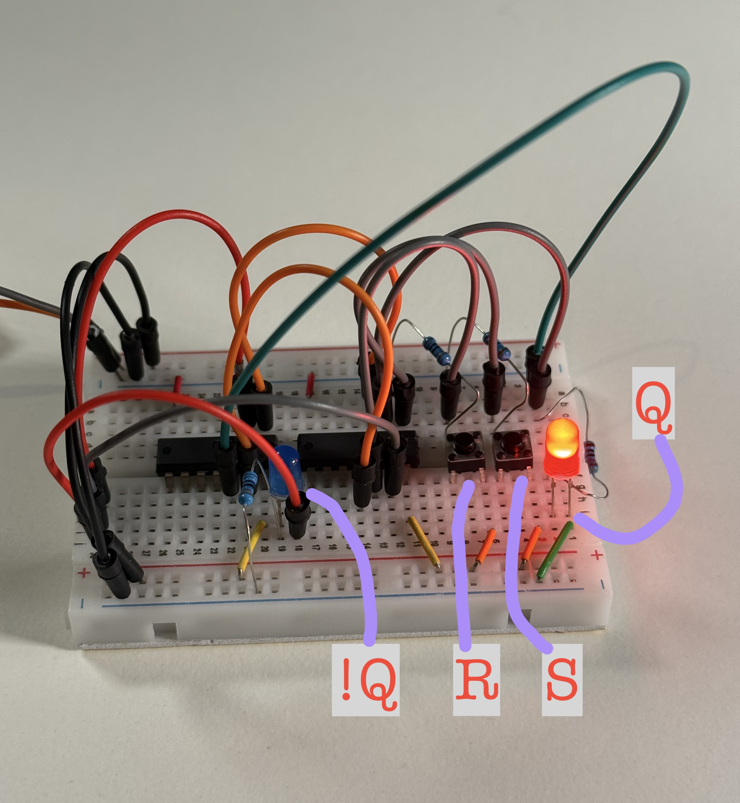
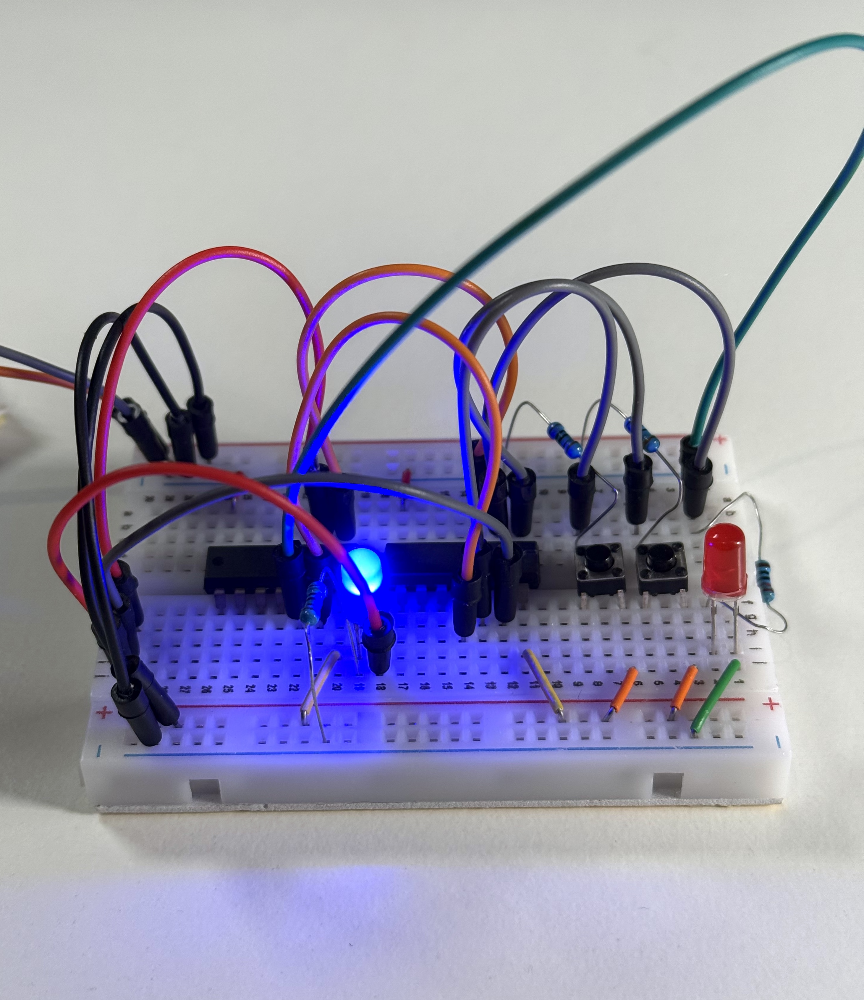
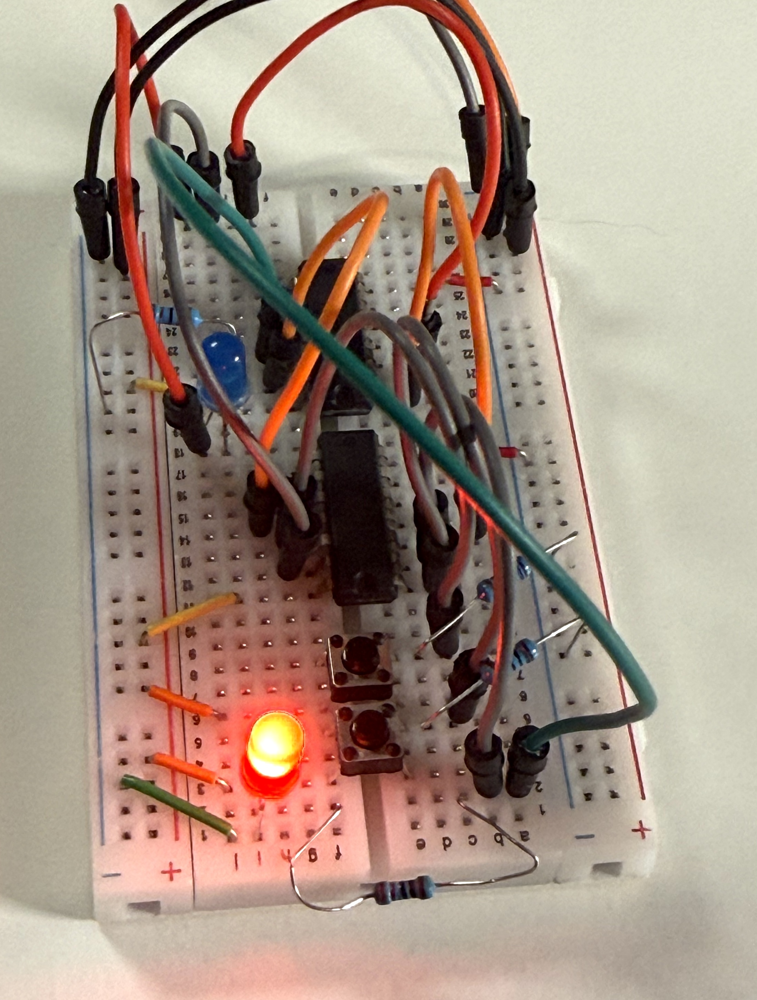
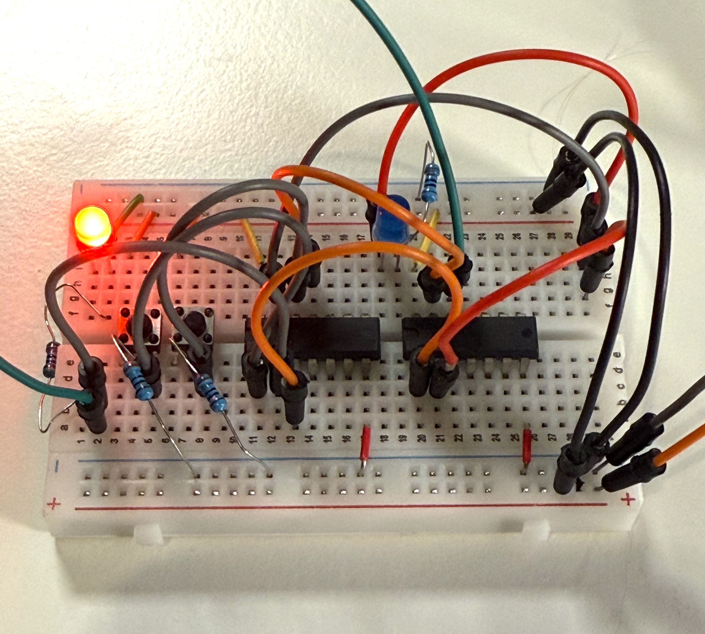

# Project 4 — Implementing 1 bit of memory - SR latch

The "memory" is built on an **SR latch** using 2 analog **NOR gates**.

The two chips below implement NOR gates because I didn't have a single NOR chip. There are 2 NOR gates on the board, as needed to implement a single SR latch device with 2 imputs (S, R) and 1 output Q.

- `SN74HC32N (7432)`  [SNx4HC32 Quadruple 2-Input OR Gates](../docs/sn74hc32.pdf)
- `SN74HC04N (7404)`  [SNx4HC04 Hex Inverters](../docs/sn74hc04.pdf)

SR latch is a type of memory device that remembers 1 bit. The SR latch has
two inputs: S (set) and R (reset), and an output Q, the single bit that is "remembered".

- The red LED represents Q
- The blue LED represents "not Q" to visualize circuit state
- When using an SR latch we typically only look at Q to determine whether the bit is true or false.

---

On the first picture below S is pressed, so the Q is HIGH, meaning that the bit is 1. The state is remembered.

On the first picture below R was pressed, so the Q is LOW, and "not Q" is HIGH (the blue LED).

---
