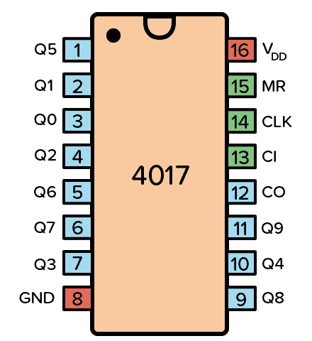
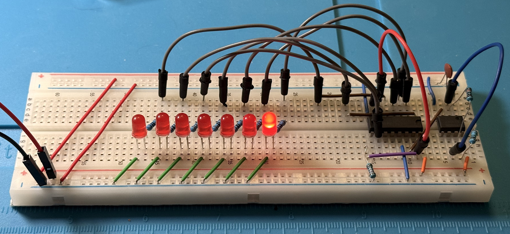
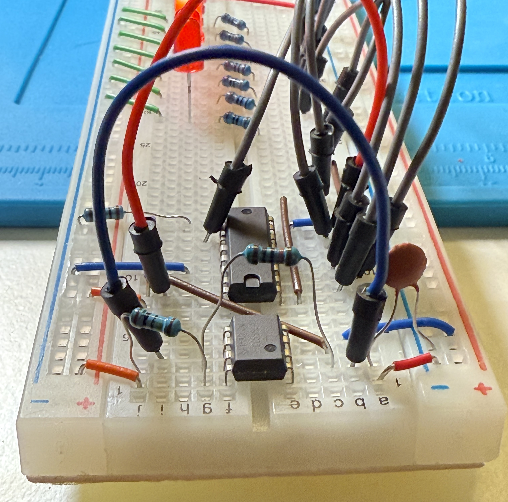
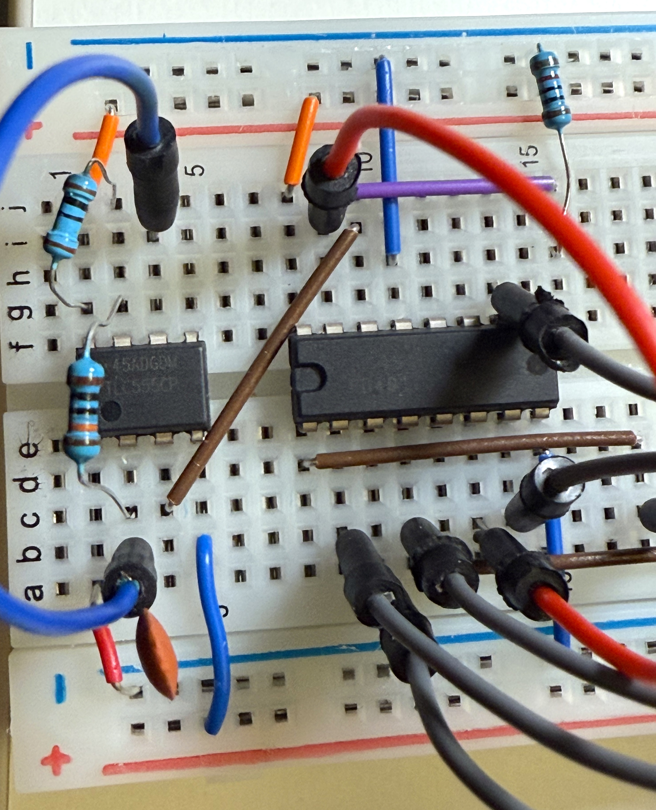
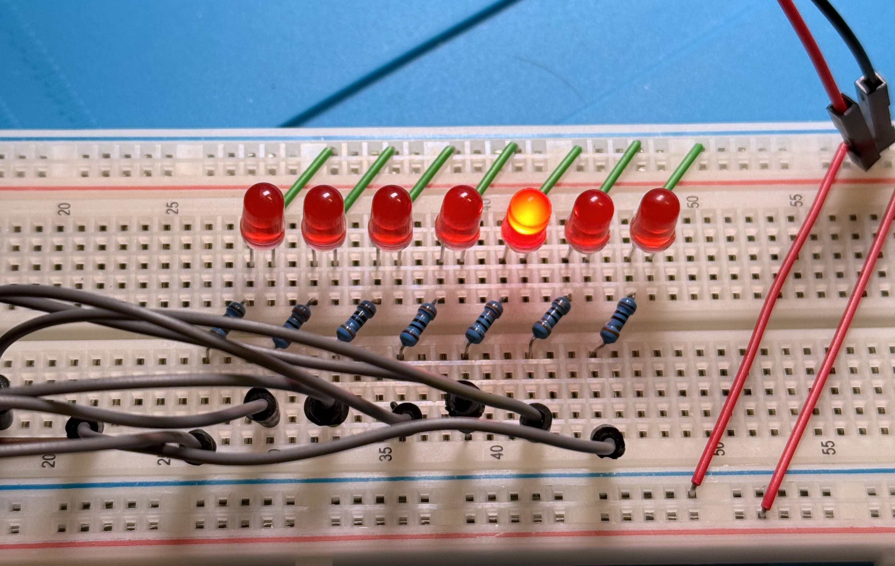
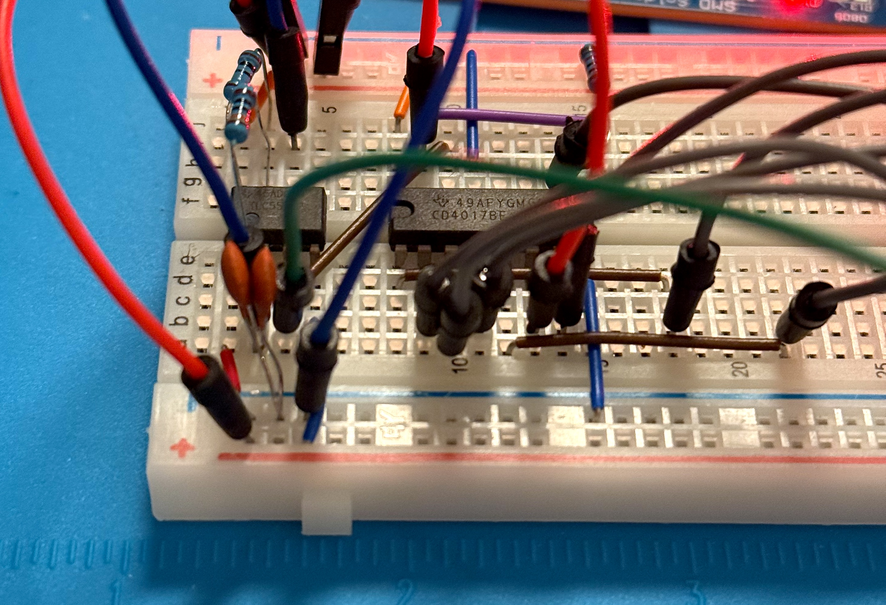

# Project 6 — LED chaser with a 555 timer and a CD4017 IC

#### 1) Clock generator (NE555 astable)

**Parts used**

* NE555 as an astable oscillator
* Timing resistors: 10 kΩ + 2 MΩ
* Timing capacitor: 0.1 µF. Later added 2x 0.1 µF to slow down the "chasing"
* Control-pin decoupling: 0.1 µF on pin 5 (CTRL) to GND.
* Recommended: 100 nF decoupling between VCC and GND close to the 555

**Wiring**

* The 555 sits straddling the breadboard's center gap.
* Pin 3 (OUT) is the "clock" line running from the 555 area to the CD4017.

---

#### 2) Sequencer (CD4017 decade counter)

The CD4017 is a 5-stage CMOS Johnson decade counter/divider with 10 decoded outputs (Q0-Q9) and a Carry Out bit, capable of counting from 0 to 10 and driving LEDs directly. It operates at 3V–15V, features a 5MHz clock speed, and is ideal for, sequencing, or frequency division.

This is the part that counts from 0 to 9 and lights up the LEDs. Each step of the counter is initiated by a clock pulse from the 555.

**Parts used**

* CD4017
* The clock input of the 4017 is fed from 555 pin 3.
* Q7 (pin 6) is connected to pin Reset (pin 15) so that the counting restarts - there are only 7 LEDs on the board

---

#### 3) LED outputs

Direct CD4017 to LED: red LED series resistors: 330 Ω, one per LED  x7

---

### Power and build notes

* Supply: 5 V
* Optional decoupling caps (100 nF) close to each IC between VCC and GND (helps stability and reduces weird flicker). I didn't do it on the pictures.
* Assembly/testing order:

  1. Build and verify the 555 clock first (I used a debug LED) and a multumeter to measure clock signal voltage.
  2. Add the CD4017 and confirm the LEDs "chase".
  3. Then add the transistor-driven outputs.

### Images

---
