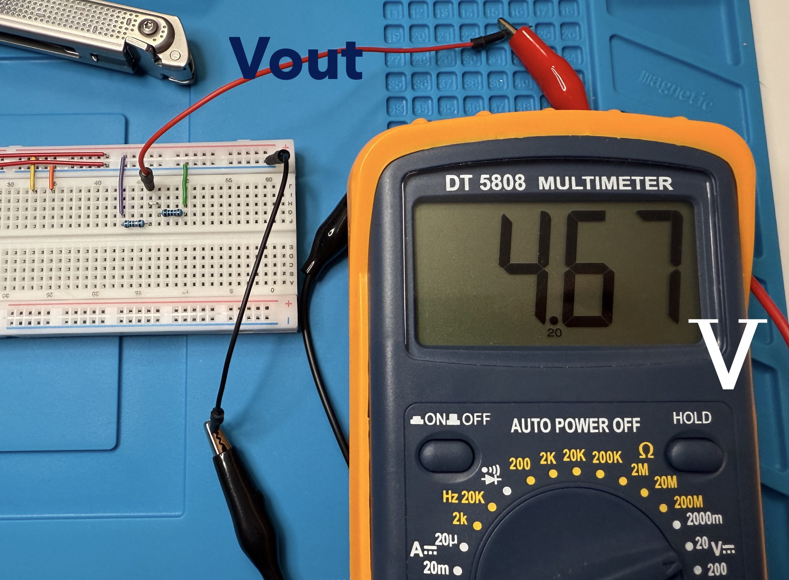
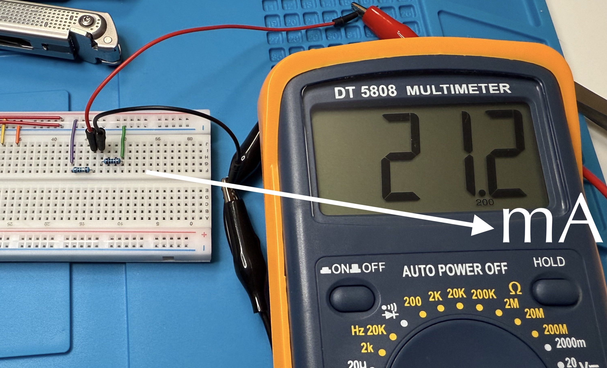
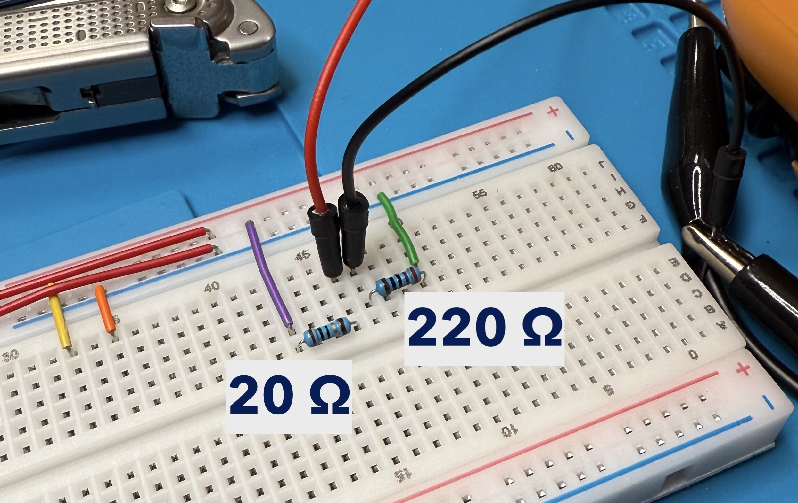
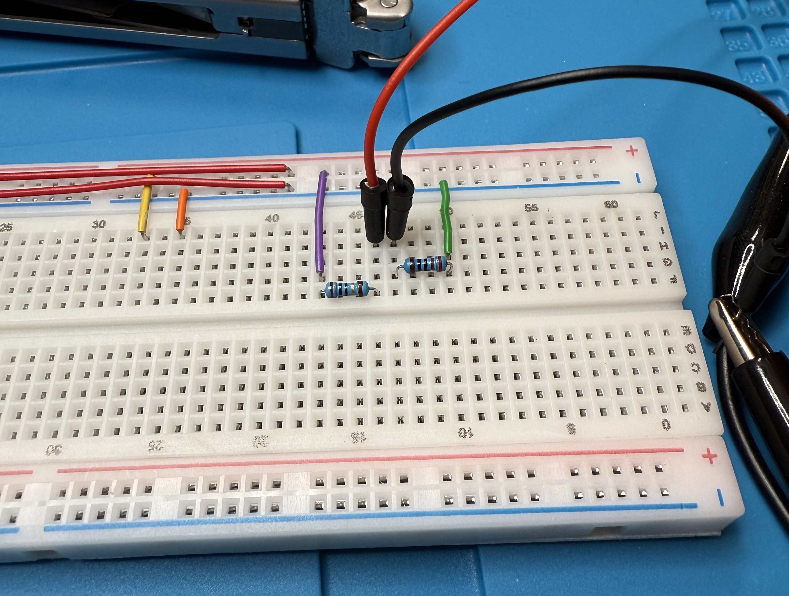

# Project 8 — Voltage divider

A voltage divider is a circuit that reduces an input voltage to a lower output voltage using two resistors in series. This is useful for scaling sensor readings, biasing circuits, or adapting signals, etc.

## Circuit specifications

- Input voltage (Vin): 5V
- Output voltage (Vout): 4.5V
- Load current (I): 20mA
- Resistor R1: 20Ω
- Resistor R2: 220Ω

## Formula

The voltage divider formula calculates the output voltage as:

$$V_{out} = \frac{R_2}{R_1 + R_2} \times V_{in}$$

Substituting the values:

$$V_{out} = \frac{220}{20 + 220} \times 5 = \frac{220}{240} \times 5 = 0.9167 \times 5 = 4.58V$$

This gives us approximately **4.5V** at the output, which matches the target specification.

## How it works

The two resistors form a voltage divider connected in series across the input voltage. The output is taken from the junction between R1 and R2. The larger R2 value means more voltage appears at the output relative to the input.

## Parts used

- 20Ω resistor (R1)
- 220Ω resistor (R2)
- Power supply (5V)
- Breadboard
- Jumper wires

---

---
